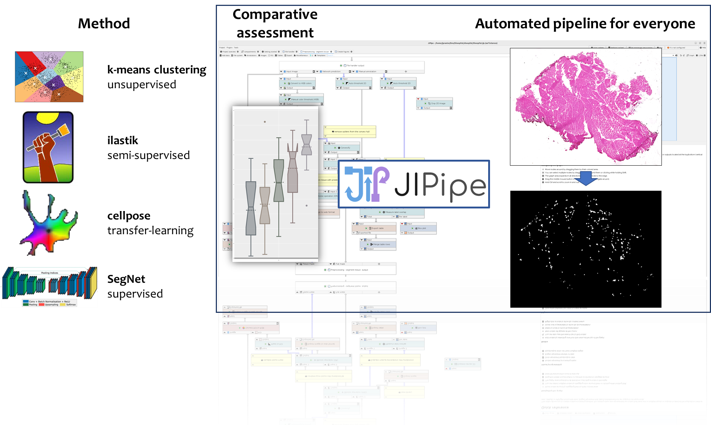

# IMFSegNet for intramuscular fat segmentation

[](https://opensource.org/licenses/BSD-2-Clause) [](https://jipipe.hki-jena.de/)

A comparative assessment of various image analysis workflows to provide a fast, accurate and objective intramuscular fat quantification of H&E stained tissue sections. To learn about JIPipe read the according [paper](https://www.nature.com/articles/s41592-022-01744-4.epdf?sharing_token=FLOeyJ971J7wxssg26JLMNRgN0jAjWel9jnR3ZoTv0N_9EKk9KTzHvjnOCzQ3fVGX2eJg_hYStRDDXbeZufNwTxGlPDR4HgFttdICXTVrJXi4MNP26n9jQ5lZZF87NmslN8FrvxbDaaqduhlJAV3MUXM9KoEN_khEYoYKIvCy5U%3D) and to learn more about the evaluation read the [paper](). 

### Citation

**If you used IMFSegNet for intramuscular fat segmentation cite the [paper](TODO):**

Praetorius, J.-P., Walluks, K., Svensson, C.-M., Arnold, D., Figge M.T. (2023). IMFSegNet: Cost-effective and objective quantification of intramuscular fat in histological sections by deep learning. <em>Publication in progress</em>.

<center class="mb-5">
  
</center>
# Installation

## Dependencies

**To compare the image analysis workflows the following dependencies need to be installed:**

- [JIPipe](https://jipipe.hki-jena.de/) (only for Linux, take: "python-cellpose-gpu") (version 1.74)
- [scikit-learn](https://scikit-learn.org/stable/index.html) for k-means clustering (version 1.0.2)
- [ilastik](https://www.ilastik.org/) (version 1.3.3)
- [Cellpose](http://www.cellpose.org/) (version 0.7.3)
- python (version 3.7)
- python libraries (here provided with a anaconda file) with [tensorflow-gpu](https://www.tensorflow.org/) (version 2.5.1) (see the next point)

#### Creating an environment from an sheepfat_env.yml file to install all python related packages

Use the terminal or an Anaconda Prompt for the following steps:

1. Create the environment from the `sheepfat/sheepfat_env.yml` file:

   ```
   conda env create -f sheepfat/sheepfat_env.yml
   ```

   The first line of the `yml` file sets the new environment's name. For details see [Creating an environment file manually](https://docs.conda.io/projects/conda/en/latest/user-guide/tasks/manage-environments.html#create-env-file-manually).

2. Activate the new environment: `conda activate sheepfat`

3. Verify that the new environment was installed correctly:

   ```
   conda env list
   ```

You can also use `conda info --envs`.

#### Installation of JIPipe within Fiji (first unzip the corresponding directories)

To get *JIPipe* running inside *Fiji* follow these steps:

1. Open this [link](https://asbdata.hki-jena.de/PraetoriusEtAl2023_ComputBiolMed) from the paper and download the required JIPipe plugin from the  `/model/JIPipe/JIPipe-1.74.0/` directory
2. Download [Fiji](https://imagej.net/software/fiji/downloads) and copy the JIPipe plugin to `/Fiji.app/plugins/`
3. Start Fiji, search for  `JIPipe` and run it
4. Open the file `/SheepFat.jip` as project from the main directory
5. Copy the required anaconda environment from the [link](https://asbdata.hki-jena.de/XYZEtAl2022/Material.zip.) `/model/JIPipe/python-cellpose-gpu/` to the`/Fiji.app/jipipe/` directory
6. Configure the prepackaged from 5. in JIPipe in order to navigate to  `/Project/Application settings/Extensions/Python integration/` and specify the according path at the `/Python environment/`  

# Run IMFSegNet manually

In case you want to start the k-means clustering or the IMFSegNet manual follow these steps:

1. Activate the new environment: `conda activate sheepfat`

2. Verify that the new environment was installed correctly:

   ```
   conda env list
   ```

3. Start a jupyter lab or notebook with

   ```
   jupyter lab
   ```

4. Run the notebooks `SheepFat_2_SegNetSegmentation` to use the SegNet and `SheepFat_3_kmeansSegmentation` to make use of the k-means based clustering workflow

   Alternatively you can start the python scripts of the **SegNet cross-validation** and the **IMFSegNet** in the terminal as follows:

   - For the **training** of the **SegNet cross-validation**, run 

     ```
     python ./examples/KW/model_0_KW.py
     ```

     and adjust the corresponding k-fold in the python script at the `model_id` variable, also specify the corresponding directory paths in the script.

   - For the **training** of the so called **IMFSegNet**, which takes all images into account, run 

     ```
     python ./examples/KW/model_all_KW.py
     ```

     and specify the corresponding directory paths in the script.

   - For the **prediction** using the **SegNet cross-validation**, run 

     ```
     python ./examples/KW/prediction_kfold.py
     ```

     and adjust the corresponding k-fold in the python script at the `model_id` variable, also specify the corresponding directory paths in the script.

   - For the **prediction** of the so called **IMFSegNet** run 

     ```
     python ./examples/KW/prediction_all.py
     ```

     and specify the corresponding directory paths in the script.

     **This option can also be used to detect intramuscular fat as accurately as possible in H&E stained tissue sections that are not included in this [study](https://asbdata.hki-jena.de/PraetoriusEtAl2023_ComputBiolMed) (see `/data/images/KW/H&E/inputs/`, first unzip the corresponding directories)**

     
